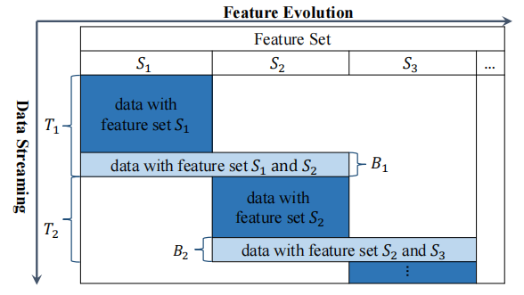
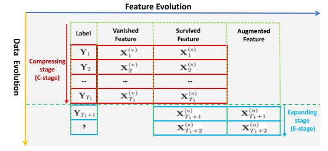
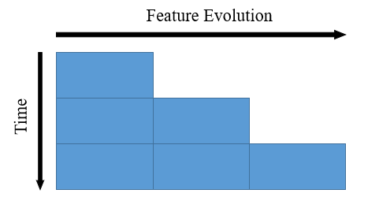

A list of papers for learning in vary feature space (open world).

## Survey

- **Towards Utilitarian Online Learning – A Review of Online Algorithms in Open Feature Space (IJCAI 2023)**
    - Yi He, Christian Schreckenberger, Heiner Stuckenschmidt, Xindong Wu
    - [Paper](https://www.ijcai.org/proceedings/2023/0745.pdf)

## Feature Evolvable Stream

- **Learning with Feature Evolvable Streams (NeurIPS 2017)**
    - Bo-Jian Hou, Lijun Zhang, Zhi-Hua Zhou
    - [Paper](https://proceedings.neurips.cc/paper/6740-learning-with-feature-evolvable-streams.pdf)
    - [Code](https://www.lamda.nju.edu.cn/code_FESL.ashx)(Matlab)
- **Learning with Feature and Distribution Evolvable Streams (ICML 2020)**
    - Zhen-Yu Zhang, Peng Zhao, Yuan Jiang, Zhi-Hua Zhou
    - [Paper](http://proceedings.mlr.press/v119/zhang20ad/zhang20ad.pdf)
    - [Code](http://www.lamda.nju.edu.cn/code_FDESL.ashx)
- **Storage Fit Learning with Feature Evolvable Streams (AAAI2021)**
    - Bo-Jian Hou, Yu-Hu Yan, Peng Zhao, Zhi-Hua Zhou
    - [Paper](https://ojs.aaai.org/index.php/AAAI/article/view/16944)
    - [Code](https://www.lamda.nju.edu.cn/code_SF2EL.ashx)(Matlab)
- **Prediction with Unpredictable Feature Evolution (TNNLS 2021)**
    - Bo-Jian Hou, Lijun Zhang, Zhi-Hua Zhou
    - [Paper](https://ieeexplore.ieee.org/abstract/document/9406178)
    - [Code](https://www.lamda.nju.edu.cn/code_PUFE.ashx)(Matlab)
- **Online Deep Learning from Doubly-Streaming Data (2022 ACMMM)**
    - Heng Lian, John Scovil Atwood, Bojian Hou, Jian Wu, Yi He
    - [Paper](https://arxiv.org/abs/2204.11793)
    - [Code](https://github.com/X1aoLian/OLD3S)

## Incremental and Decremental Features

- **One-Pass Learning with Incremental and Decremental Features (TPAMI 2016)**
    - Chenping Hou, Zhi-Hua Zhou
    - [Paper](https://arxiv.org/pdf/1605.09082.pdf)
- **Safe Classification with Augmented Features (TPAMI 2019)**
    - Chenping Hou, Ling-Li Zeng, Dewen Hu
    - [Paper](https://ieeexplore.ieee.org/document/8392390)
- **Rectify Heterogeneous Models with Semantic Mapping (ICML 2018)**
    - Han-Jia Ye, De-Chuan Zhan, Yuan Jiang, Zhi-Hua Zhou
    - [Paper](https://cs.nju.edu.cn/zhouzh/zhouzh.files/publication/icml18reform.pdf)
    - [Code](https://www.lamda.nju.edu.cn/code_ReForm.ashx)(Matlab)
- **Incremental Feature Spaces Learning with Label Scarcity (TKDD 2022)**
    - Shilin Gu, Yuhua Qian, Chenping Hou
    - [Paper](https://dl.acm.org/doi/10.1145/3516368)
- **Adaptive feature selection with augmented attributes (TPAMI 2023)**
    - Chenping Hou, Ruidong Fan, Ling-Li Zeng, Dewen Hu
    - [Paper](https://ieeexplore.ieee.org/abstract/document/10021870)
- **Evolving Metric Learning for Incremental and Decremental Features (TCSVT 2021)**
    - Jiahua Dong, Yang Cong, Gan Sun, Tao Zhang, Xu Tang, Xiaowei Xu
    - [Paper](https://arxiv.org/pdf/2006.15334.pdf)

## Varying Feature Space

- **Online Learning from Data Streams with Varying Feature Spaces (AAAI 2019)**
    - Ege Beyazit, Jeevithan Alagurajah, Xindong Wu
    - [Paper](https://ojs.aaai.org/index.php/AAAI/article/download/4192/4070)
    - [Code](https://github.com/p-koenig/OLVF_final)(Go)
- **Online Learning from Capricious Data Streams: A Generative Approach (IJCAI 2019)**
    - Yi He, Baijun Wu, Di Wu, Ege Beyazit, Sheng Chen, Xindong Wu
    - [Paper](https://www.ijcai.org/proceedings/2019/0346.pdf)
- **Online Learning in Variable Feature Spaces under Incomplete Supervision (AAAI 2021)**
    - Yi He, Xu Yuan, Sheng Chen, Xindong Wu
    - [Paper](https://ojs.aaai.org/index.php/AAAI/article/view/16532)
- **Online Random Feature Forests for Learning in Varying Feature Spaces (AAAI 2023)**
    - Yi He, Xu Yuan, Sheng Chen, Xindong Wu
    - [Paper](https://ojs.aaai.org/index.php/AAAI/article/view/25581)
- **Online Learning in Variable Feature Spaces with Mixed Data (ICDM 2021)**
    - Yi He, Jiaxian Dong, Bo-Jian Hou, Yu Wang, Fei Wang
    - [Paper](https://ieeexplore.ieee.org/document/9679013)
    - [Code](https://github.com/xiexvying/OVFM)

## Trapezoidal Data Stream

- **Online Learning from Trapezoidal Data Streams (TKDE 2016)**
    - Qin Zhang, Peng Zhang, Guodong Long, Wei Ding, Chengqi Zhang, Xindong Wu
    - [Paper](https://ieeexplore.ieee.org/document/7465766)
- **Towards Mining Trapezoidal Data Streams (ICDM 2016)**
    - Qin Zhang, Peng Zhang, Guodong Long, Wei Ding, Chengqi Zhang, Xindong Wu
    - [Paper](https://ieeexplore.ieee.org/document/7373444)

